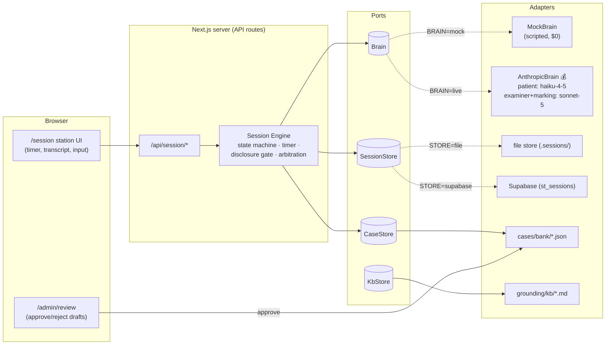
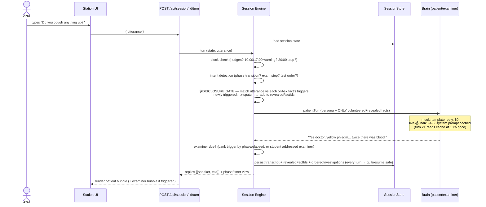
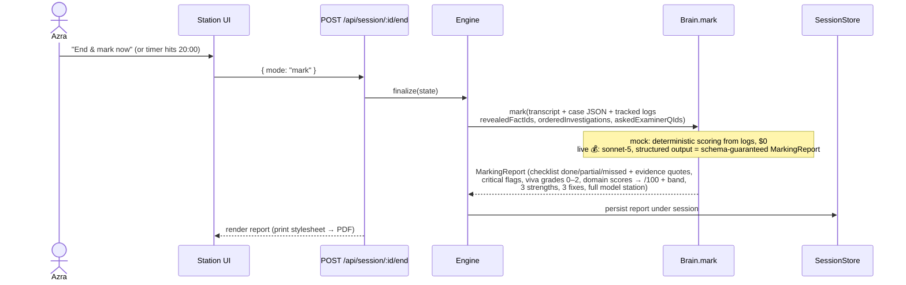
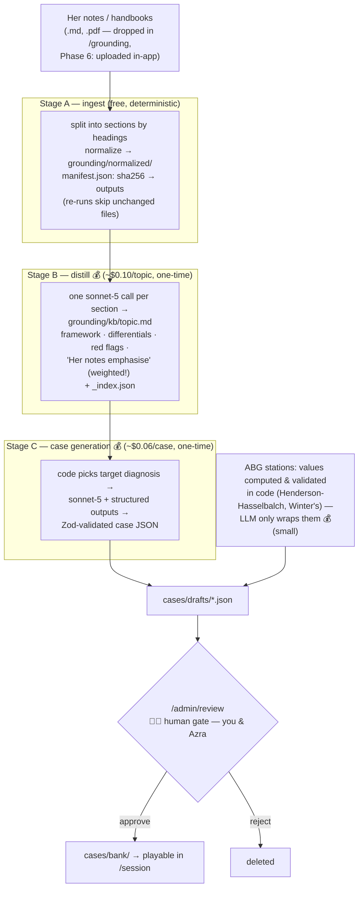
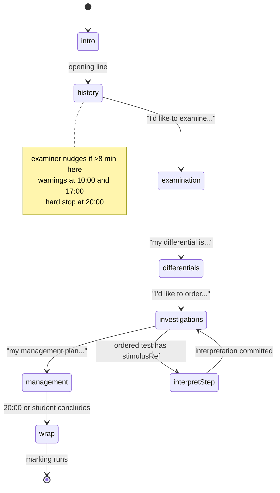
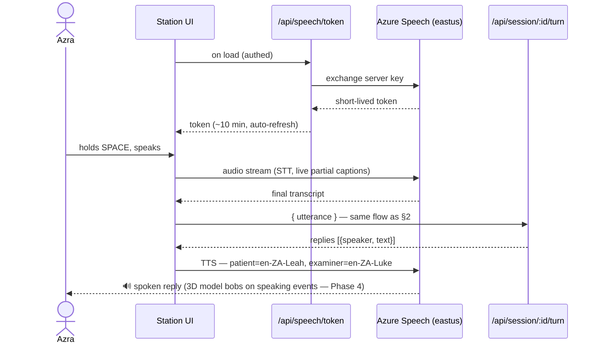

# St Mungo's — Architecture & Flow

How the whole machine fits together. Diagrams are Mermaid — GitHub renders them; in VS Code use a Mermaid preview extension.

💰 marks the steps that spend Anthropic API credit. Everything else is free.

---

## 1. The big picture (components, ports & adapters)

The session engine only ever talks to **ports** (interfaces). Vendors are swappable **adapters** behind them — that's why the whole app runs at $0 against `MockBrain`, and why Azure/Anthropic/Supabase could each be replaced without touching the engine.

---

## 2. One conversation turn (text mode — what exists today)

The heart of the app. Note the **disclosure gate**: the patient model never receives the full case — only facts the student has already earned. It cannot leak what it never saw.

---

## 3. End of station — marking

One API call per session (💰 the priciest single call, ~$0.05–0.08), anchored to the checklist — never vibes.

---

## 4. Knowledge pipeline — her notes become examiners

**This answers the upload question: yes.** New notes (md preferred, pdf accepted — including AI-generated ones) enter here. Today stages A–B run as a CLI; Phase 6 adds the in-app upload UI that calls the *same* `lib/kb-pipeline/` code, so nothing is rebuilt.

Key properties: **incremental** (only new/changed notes are processed — money is never spent twice), **resumable** (manifest checkpoints after every call), **gated** (nothing reaches Azra without human approval), **private** (raw notes stay on disk, gitignored; only distilled excerpts ride in API calls, which Anthropic does not train on).

---

## 5. Session phases (the exam itself)

Interpretation stations (ABG/ECG/CXR) run the shorter `present → interpret → probe → wrap` machine with a 7:00 timer.

---

## 6. Voice turn (Phase 3 — next to build)

Push-to-talk wraps the *existing* text turn; nothing in §2 changes. The browser never sees the Azure key — it gets a ~10-minute token.

---

## 7. Where the money goes

| Step | Model | When | Cost |
|---|---|---|---|
| Distill a KB topic | sonnet-5 | once per topic | ~$0.10 |
| Generate a case | sonnet-5 (structured, no thinking) | once per case | ~$0.06 |
| Patient turn | haiku-4-5 (cached) | per turn, live sessions | ~$0.002 |
| Examiner follow-up | sonnet-5 | few per session | ~$0.01 |
| Marking report | sonnet-5 (structured) | once per session | ~$0.05–0.08 |
| **Full 20-min live station** | | | **≈ $0.10–0.15** |
| Mock station, review UI, timers, ABG math, ingest | — | always | $0 |

Azure Speech (Phase 3): F0 free tier = 5h STT + 0.5M TTS chars/month; beyond that ~$1/h.
